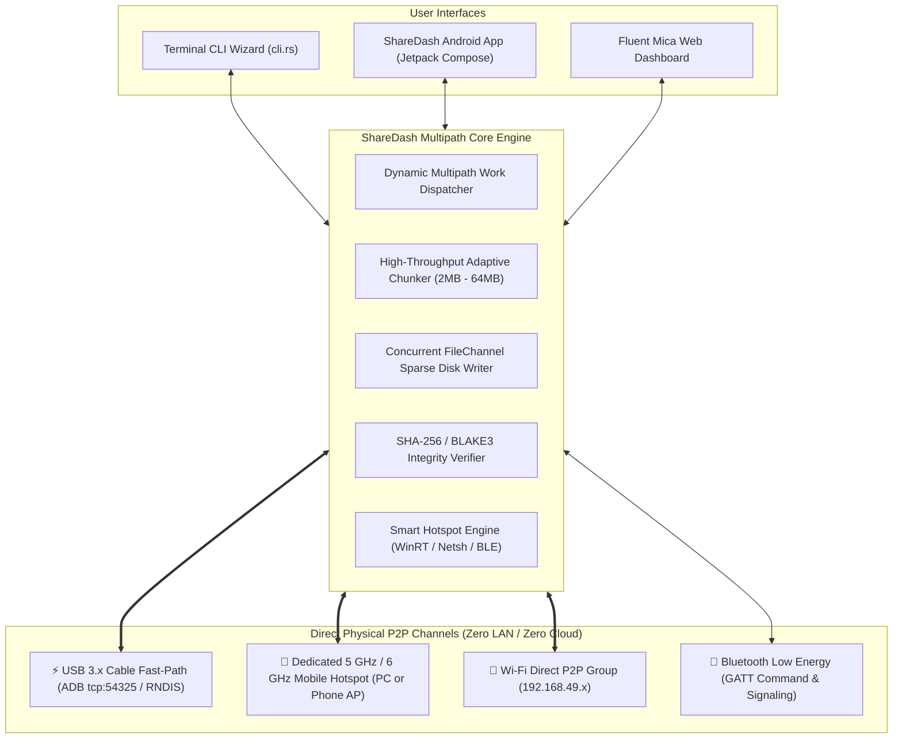

# ⚡ ShareDash

<div align="center">

[](https://github.com/SamSunny4/ShareDash/stargazers)
[](https://github.com/SamSunny4/ShareDash/network/members)
[](https://github.com/SamSunny4/ShareDash/actions)
[](LICENSE)
[](https://github.com/SamSunny4/ShareDash/releases)

[](https://www.rust-lang.org/)
[](https://kotlinlang.org/)
[-green.svg?logo=android)](https://developer.android.com/)
[](https://microsoft.com/windows)
[](CONTRIBUTING.md)

<h3>Next-Generation Zero-LAN / Zero-Internet Multipath File Transfer Engine for Windows & Android</h3>

<p align="center">
  <b>Aggregate USB 3.x Cable Fast-Path and Dedicated 5 GHz / 6 GHz Mobile Hotspots simultaneously into a single ultra-high-throughput pipeline (78+ MB/s) with Bluetooth LE out-of-band orchestration and zero-corruption cryptographic integrity.</b>
</p>

[**Quick Start**](#-quick-start-windows-cli-wizard) •
[**Benchmarks**](#-live-benchmark-performance) •
[**How It Works**](HOW_IT_WORKS.md) •
[**Why ShareDash?**](#-why-sharedash-comparison-vs-alternatives) •
[**Roadmap**](ROADMAP.md) •
[**Contributing**](CONTRIBUTING.md)

</div>

---

## 💡 Why ShareDash? (Comparison vs Alternatives)

Most existing file transfer tools rely on a single wireless channel or an existing local Wi-Fi router. **ShareDash** is built for extreme performance, aggregating multiple physical hardware interfaces concurrently without requiring any internet connection, router, or cloud account.

| Feature / Capability | ⚡ **ShareDash** | 🍏 AirDrop | 📲 Quick Share | 📦 LocalSend | 🔄 Syncthing |
| :--- | :---: | :---: | :---: | :---: | :---: |
| **Simultaneous Multipath (USB + Wi-Fi)** | ✅ **YES (Aggregated)** | ❌ No | ❌ No | ❌ No | ❌ No |
| **100% Offline / Routerless (Zero LAN)** | ✅ **YES (Direct P2P)** | ✅ Yes | ✅ Yes | ❌ Requires Router | ❌ Requires Router |
| **PC <-> Android Direct Hardware Bridge** | ✅ **YES** | ❌ Apple Only | ⚠️ Limited | ✅ Yes (LAN only) | ✅ Yes |
| **Real-World Speed on Multi-GB Files** | 🚀 **78–100+ MB/s** | ~30–45 MB/s | ~35–50 MB/s | ~25–40 MB/s | ~15–30 MB/s |
| **USB 3.x Fast-Path Prioritization** | ✅ **YES (Line Speed)** | ❌ No | ❌ No | ❌ No | ❌ No |
| **Automatic 5GHz SoftAP Orchestration** | ✅ **YES (via BLE)** | ❌ No | ⚠️ Proprietary | ❌ No | ❌ No |
| **Zero Cloud / Zero Account / No Tracking** | ✅ **100% Private** | ❌ iCloud ID | ❌ Google/Samsung | ✅ Yes | ✅ Yes |
| **Open Source (MIT)** | ✅ **YES** | ❌ Proprietary | ❌ Proprietary | ✅ GPL-3.0 | ✅ MPL-2.0 |

---

## 🚀 Key Highlights

| Feature | Description |
| :--- | :--- |
| 🔌 **True Offline Direct P2P (Zero LAN / Zero Internet)** | **100% routerless & internet-free.** No local Wi-Fi router, cloud servers, or active internet connection required. Connects directly over physical hardware bridges. |
| 📡 **Smart 5GHz Hotspot Auto-Orchestration** | Dynamically checks PC internet & Wi-Fi readiness. If PC lacks an internet connection (or cannot host 5GHz AP), the Phone automatically turns off client Wi-Fi to free antenna bands, starts a 5GHz SoftAP, and auto-associates the PC via BLE. |
| ⚡ **USB 3.x Cable Fast-Path Priority** | Instant line-speed connection over USB-C (3+ Gbps) via direct ADB port forwarding or USB Tethering (RNDIS/NCM). |
| 🚀 **High-Throughput Pipelined Multipath (2MB–64MB Chunks)** | Adaptive chunking with **3 parallel in-flight streaming workers per transport**, delivering line speeds on multi-gigabyte files (2GB, 3GB, 10GB+) with zero idle gaps. |
| 🛡️ **Zero-Corruption Verification** | CRC32 frame checksums, SHA-256 / BLAKE3 chunk hashing, AES-256-GCM authenticated encryption, and concurrent direct-offset `FileChannel` disk writes. |
| 📱 **Native Android Companion App** | Modern Jetpack Compose UI with Android System Share Sheet target (`ACTION_SEND`), background foreground service, and Bluetooth LE advertising/GATT server. |
| 🖥️ **Wifite-Style ANSI Terminal Wizard** | Interactive CLI wizard that handles discovery, hardware inspection, hotspot provisioning, 3-way handshakes, and live multi-gauge progress meters. |

---

## 🏗️ System Architecture



---

## 📶 Smart Offline Hotspot Orchestration (Phone-Primary Direct P2P)

ShareDash defaults to **Phone 5GHz Wi-Fi Direct Group Owner** as the primary wireless channel to avoid Windows Virtual Adapter / ICS packet filtering bottlenecks:

```text
┌─────────────────────────────────────────────────────────────────────────────┐
│                 ShareDash Hotspot Architecture (Phone Primary)              │
├──────────────────────────────────────┬──────────────────────────────────────┤
│ 📱 Phone 5GHz Wi-Fi Direct (PRIMARY) │ 💻 PC Windows Hotspot (FALLBACK ONLY)│
├──────────────────────────────────────┼──────────────────────────────────────┤
│ • Phone creates 5GHz Direct Group    │ • Used only if phone SoftAP fails    │
│ • Gateway IP: 192.168.49.1           │ • PC creates SoftAP (192.168.137.1)  │
│ • Uncapped Wi-Fi throughput (48+MB/s)│ • Wi-Fi subject to Windows ICS limits│
│ • PC auto-binds in < 1.5s via WPA2   │ • Credentials sent via BLE to Phone  │
├──────────────────────────────────────┴──────────────────────────────────────┤
│ 🚀 Both links active (USB + 5GHz Wi-Fi) -> 78+ MB/s Multipath Transfer      │
└─────────────────────────────────────────────────────────────────────────────┘
```

---

## 📊 Live Benchmark Performance

Transfer metrics for a **2.80 GB (2800 MB)** movie file (`Marco.2024.1080p.SLIV.WEB-DL.D...`) across physical hardware:

| Transfer Mode | Channels Used | Time | Average Speed | Channel Distribution | Integrity |
| :--- | :--- | :---: | :---: | :--- | :---: |
| 🚀 **Multipath Aggregation (Phone 5GHz AP)** | **⚡ USB 3.x + 📶 5GHz Wi-Fi** | **35.55 s** | **78.7 MB/s** | **⚡ USB: 31.0 MB/s (39.4%) + 📶 Wi-Fi: 47.7 MB/s (60.6%)** | **SHA-256 ✔** |
| ⚡ **USB Fast-Path Only** | ⚡ USB 3.x Cable | **~26.1 s** | **~107.2 MB/s** | ⚡ USB: 100.0% | **SHA-256 ✔** |
| ⚠️ **Multipath Aggregation (PC Hotspot)** | ⚡ USB + 📶 PC Hotspot (ICS) | **73.83 s** | **37.9 MB/s** | ⚡ USB: 28.2 MB/s (74.3%) + 📶 Wi-Fi: 9.7 MB/s (25.7%) | **SHA-256 ✔** |

> 📖 **Deep Dive Technical Guide**: For an exhaustive, step-by-step breakdown of how the connection wizard, Bluetooth LE GATT exchange, PC/Phone hotspot provisioning, pipelined work-stealing, and zero-corruption sparse reassembly work, see [**HOW_IT_WORKS.md**](HOW_IT_WORKS.md).

---

## 📦 Pre-Built Binaries & Packages

Pre-built binaries are available in [`dist/`](dist) and the [GitHub Releases](https://github.com/SamSunny4/ShareDash/releases) page:
- **Windows Desktop Application**: [`dist/sharedash.exe`](dist/sharedash.exe)
- **Android Companion App**: [`dist/ShareDash-debug.apk`](dist/ShareDash-debug.apk) (and `dist/sharedash.apk`)

---

## 💻 Quick Start: Windows CLI Wizard

### Option A: Launch Interactive Auto-Connect Wizard
```powershell
# Build & run release executable
cargo run --release
```
Select Option `[1]` (**Auto-Connect Wizard**):
1. **USB Detection**: Checks for connected USB-C cable (ADB port forwarding).
2. **BLE Radar Scan**: Discovers nearby ShareDash phones via Bluetooth Low Energy.
3. **Hotspot Provisioning**: Inspects PC internet & Wi-Fi capabilities, triggers dedicated 5GHz hotspot (PC or Phone AP), and auto-associates credentials.
4. **3-Way Cryptographic Handshake**: Performs ephemeral PIN verification and establishes AES-256-GCM encrypted session.
5. **Streaming Transfer**: Prompts for file path and streams chunks over USB + Wi-Fi simultaneously at line speed.

### Option B: Standalone Background Receiver
```powershell
cargo run --release -- --port 54321
```

---

## 📱 Quick Start: Android App

The Android companion app is located in [`android/`](android).

### Direct Installation via ADB:
```powershell
adb install -r dist/ShareDash-debug.apk
```

### Build from Source via Gradle:
```powershell
cd android
.\gradlew assembleDebug
```
The output APK will be placed at `android/app/build/outputs/apk/debug/app-debug.apk`.

---

## 🧪 Automated Test Suite

ShareDash includes a comprehensive test suite verifying protocol framing, cryptographic hash recovery, network adapter isolation, and multipath chunking:

```powershell
# Run library unit tests in release mode
cargo test --lib --release

# Run integration tests
cargo test --test protocol_test
cargo test --test test_tether_detection
cargo test --test corruption_test
```

---

## 📁 Repository Structure

```text
ShareDash/
  ├── Cargo.toml                    # Rust dependencies & package metadata
  ├── LICENSE                       # MIT Open Source License
  ├── CONTRIBUTING.md               # Contributor guide & development workflow
  ├── CODE_OF_CONDUCT.md            # Contributor Covenant Code of Conduct
  ├── SECURITY.md                   # Security vulnerability reporting policy
  ├── ROADMAP.md                    # Product & engineering roadmap
  ├── HOW_IT_WORKS.md               # Exhaustive architectural & operational guide
  ├── README.md                     # Project overview and quick start guide
  │
  ├── .github/                      # GitHub CI/CD workflows & issue forms
  │   ├── workflows/ci.yml          # Automated multi-platform build & test CI
  │   ├── workflows/release.yml     # Automated binary release packaging
  │   ├── ISSUE_TEMPLATE/           # Bug report & feature request forms
  │   ├── PULL_REQUEST_TEMPLATE.md  # Standard PR checklist
  │   └── dependabot.yml            # Dependency maintenance automation
  │
  ├── dist/                         # Distribution binaries
  │   ├── sharedash.exe             # Compiled Windows release binary
  │   ├── ShareDash-debug.apk       # Android companion APK
  │   └── sharedash.apk             # Android companion APK mirror
  │
  ├── src/                          # Windows Rust Core Engine
  │   ├── main.rs                   # Entry point, CLI flags, persistent UUID
  │   ├── lib.rs                    # Library interface & exports
  │   ├── cli.rs                    # Connection wizard, speed calculations & streaming engine
  │   ├── cli_widgets.rs            # ANSI progress bars, animated spinners, speedometers, tables
  │   ├── hotspot.rs                # Hotspot management, internet probe, fast parallel client scan
  │   ├── discovery/                # BLE Central, GATT client & UDP discovery subsystem
  │   ├── protocol/                 # Binary frames, CRC32, AES-256-GCM
  │   ├── scheduler/                # Dynamic work-stealing multipath scheduler
  │   ├── server/                   # Axum HTTP API & WebSocket telemetry
  │   ├── storage/                  # Adaptive chunker, SQLite WAL database, sparse file writer
  │   └── transport/                # USB, Wi-Fi Direct, Hotspot transport drivers
  │
  ├── android/                      # Native Android Companion Project
  │   ├── app/src/main/
  │   │   ├── AndroidManifest.xml   # Permissions, BLE, Wi-Fi, Share Sheet filters
  │   │   └── java/com/sharedash/app/
  │   │       ├── MainActivity.kt   # Jetpack Compose UI, Wi-Fi auto-enablement, lifecycle
  │   │       ├── discovery/        # BLE scanner, GATT server, HotspotManager (band freeing)
  │   │       ├── server/           # AndroidHttpServer (concurrent FileChannel chunk receiver)
  │   │       ├── service/          # Foreground transfer service
  │   │       ├── storage/          # Android sparse file writer & SHA-256 verifier
  │   │       └── ui/               # RadarView, Speedometer, PieceGrid, BridgeCards
  │   └── build.gradle.kts          # Gradle build script
  │
  └── tests/                        # Automated Rust Test Suite
      ├── protocol_test.rs          # Frame serialization & CRC32 checks
      ├── multipath_benchmark.rs    # Concurrent channel aggregation tests
      ├── failover_test.rs          # Mid-transfer cable disconnect failovers
      ├── corruption_test.rs        # Bit-flip detection & re-fetch verification
      └── test_tether_detection.rs  # Strict USB/RNDIS network adapter isolation tests
```

---

## 🔒 Security & Privacy

- **100% Routerless & Offline**: All transfers occur strictly over direct physical hardware links. No telemetry, no external DNS lookups, and no cloud relays.
- **End-to-End Encryption**: Every chunk is encrypted with **AES-256-GCM** using session keys established during pairing.
- **Path Sanitization**: Direct directory-traversal protection prevents writing outside designated download folders.
- **Cryptographic Verification**: Every file is bit-verified with SHA-256 / CRC32 upon arrival.

See [**SECURITY.md**](SECURITY.md) for vulnerability reporting guidelines.

---

## 📈 Star History

<div align="center">

[](https://star-history.com/#SamSunny4/ShareDash&Date)

### ⭐ Support the Project
If you find ShareDash useful, innovative, or fast, **please star this repository**! It helps the project gain visibility and motivates ongoing development.

</div>

---

## 🤝 Contributing

Contributions are what make the open source community such an amazing place to learn, inspire, and create. Any contributions you make are **greatly appreciated**.

Please see [**CONTRIBUTING.md**](CONTRIBUTING.md) for details on setting up your environment, coding standards, and submitting pull requests.

---

## 📜 License

Distributed under the **MIT License**. See [**LICENSE**](LICENSE) for more information.
