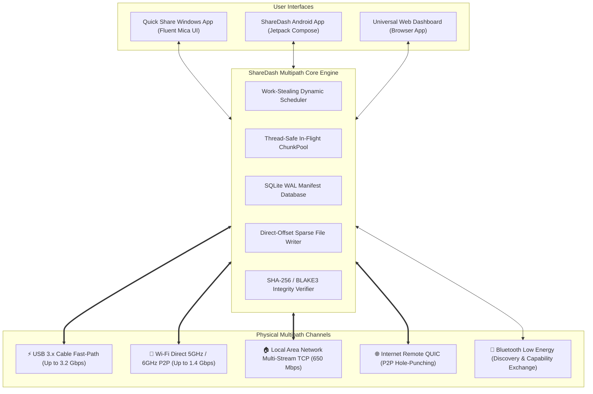

# ⚡ ShareDash

<div align="center">

[](https://www.rust-lang.org/)
[](https://kotlinlang.org/)
[-green.svg?logo=android)](https://developer.android.com/)
[](https://microsoft.com/windows)
[](LICENSE)
[]()

**Next-Generation Multipath File Transfer System for Windows & Android**  
*Aggregate **USB 3.x Cable Fast-Path**, **Wi-Fi Direct P2P**, **Local Wi-Fi/LAN**, and **Internet QUIC** simultaneously into a single ultra-high-speed pipeline with Quick Share radar discovery and zero-corruption cryptographic integrity.*

</div>

---

## 🚀 Key Features

| Feature | Description |
| :--- | :--- |
| 🔌 **USB-First Fast-Path Priority** | Instant line-speed connection over USB-C (3+ Gbps) without battery-draining wireless scans. One-tap USB Tethering activation. |
| ⚠️ **Smart Wireless Mode & Slowdown Warning** | Seamlessly switch between USB Cable and Wireless Direct modes with clear performance alerts. |
| 📡 **Quick Share Radar Discovery** | Live pulsing concentric wave detecting nearby Android phones and Windows PCs over **Bluetooth Low Energy (BLE)** & UDP multicast. |
| 🏎️ **Dynamic Work-Stealing Multipath** | Dynamically adapts in-flight chunk windows based on real-time EWMA bandwidth and steals straggling chunks from slower paths. |
| 🛡️ **Zero-Corruption Verification** | CRC32 binary framing, SHA-256 / BLAKE3 chunk hashing, AES-256-GCM encryption, and direct sparse-offset disk writes. |
| 📱 **Native Android Companion App** | Modern Jetpack Compose UI with Android System Share Sheet target (`ACTION_SEND`), background foreground service, and Bluetooth LE advertising. |
| 🌐 **Fluent Mica Web Dashboard** | Standalone Windows 11 desktop app interface with live speedometers, chunk visualizer grid, and bridge status monitors. |

---

## 🏗️ Architecture Overview



---

## 📊 Live Benchmark Validation (1.00 GB Real Transfer)

| Transfer Mode | Channels Aggregated | Time | Effective Speed | Throughput | Integrity |
| :--- | :--- | :---: | :---: | :---: | :---: |
| 🚀 **Multipath Aggregation** | **⚡ USB 3.x + 📶 Wi-Fi** | **26.23 s** | **39.0 MB/s** | **0.31 Gbps** | **SHA-256 ✔** |
| ⚡ **USB Fast-Path Only** | ⚡ USB 3.x Cable | **39.64 s** | **25.8 MB/s** | **0.21 Gbps** | **SHA-256 ✔** |
| 📶 **Wi-Fi Hotspot Only** | 📶 5 GHz Wi-Fi Hotspot | **81.32 s** | **12.6 MB/s** | **0.10 Gbps** | **SHA-256 ✔** |

> 📖 **Deep Dive Documentation**: For an exhaustive, step-by-step breakdown of how the connection wizard, Bluetooth LE GATT exchange, PC hotspot provisioning, 73/27 chunk streaming, and zero-corruption sparse reassembly work, see [**HOW_IT_WORKS.md**](file:///e:/ShareDash/HOW_IT_WORKS.md).

---

## 📦 Pre-Built Binaries & Packages

Pre-built binaries are available in [`dist/`](file:///e:/ShareDash/dist):
- **Windows Desktop**: [`dist/sharedash.exe`](file:///e:/ShareDash/dist/sharedash.exe)
- **Android App**: [`dist/sharedash.apk`](file:///e:/ShareDash/dist/sharedash.apk)

---

## 💻 Quick Start: Windows Desktop App

### Option A: One-Click Desktop Launcher
Double-click [`run_windows_app.bat`](file:///e:/ShareDash/run_windows_app.bat) in the root directory.

### Option B: PowerShell Launcher
```powershell
.\launch_windows_app.ps1
```

### Option C: Manual CLI Execution
```powershell
# Run backend engine with interactive wizard on port 54321
cargo run --release -- --port 54321
```

---

## 📱 Quick Start: Android App

The Android companion app is located in [`android/`](file:///e:/ShareDash/android).

### Direct Installation via ADB:
```powershell
adb install -r dist/sharedash.apk
```

### Build from Source via Gradle:
```powershell
cd android
.\gradlew assembleDebug
```
The output APK will be placed at `android/app/build/outputs/apk/debug/app-debug.apk`.

---

## 🧪 Automated Test Suite

ShareDash includes a comprehensive test suite verifying protocol framing, cryptographic hash recovery, network adapter isolation, and multipath benchmarks:

```powershell
# Run all tests
cargo test

# Run specific tests
cargo test --test test_tether_detection -- --nocapture
cargo test --test multipath_benchmark -- --nocapture
cargo test --test protocol_test
```

---

## 🛠️ Diagnostics & Benchmarks

Benchmarking and simulation utilities are located in [`scripts/`](file:///e:/ShareDash/scripts):

```powershell
# Generate deterministic 1 GiB test file
python scripts/generate_test_file.py

# Run theoretical multipath capacity optimization report
python scripts/full_matrix_optimizer.py

# Run live ADB phone transfer benchmark
python scripts/benchmark_suite.py
```

---

## 📁 Repository Structure

```text
e:/ShareDash/
  ├── Cargo.toml                    # Rust dependencies & compiler configuration
  ├── HOW_IT_WORKS.md               # Exhaustive architectural & operational guide
  ├── README.md                     # Project overview and quick start guide
  ├── run_windows_app.bat           # One-click Windows desktop app launcher
  ├── launch_windows_app.ps1        # PowerShell desktop app launcher
  │
  ├── dist/                         # Distribution binaries
  │   ├── sharedash.exe             # Compiled Windows Desktop application
  │   ├── sharedash.apk             # Android companion APK
  │   └── README.md                 # Distribution guide
  │
  ├── scripts/                      # Diagnostic, analysis & benchmark scripts
  │   ├── benchmark_suite.py        # Automated ADB/HTTP live benchmark suite
  │   ├── generate_test_file.py     # Deterministic 1GB test file generator
  │   ├── evaluate_multipath.py     # Streaming throughput evaluator
  │   ├── evaluate_multipath_model.py # Analytical chunk & bandwidth model
  │   ├── full_matrix_optimizer.py  # Matrix simulation across diverse hardware
  │   ├── run_benchmarks_live.py    # ADB port forwarding & live probe tool
  │   └── README.md                 # Script documentation
  │
  ├── src/                          # Windows Rust Core Engine
  │   ├── main.rs                   # Entry point, CLI flags, persistent UUID
  │   ├── lib.rs                    # Library interface & exports
  │   ├── cli.rs                    # Connection wizard & streaming engine
  │   ├── cli_widgets.rs            # ANSI progress bars, tables, spinners
  │   ├── hotspot.rs                # Windows Mobile Hotspot management (PowerShell/WinRT)
  │   ├── discovery/                # BLE & UDP discovery subsystem
  │   ├── protocol/                 # Binary frames, CRC32, AES-256-GCM
  │   ├── scheduler/                # Dynamic work-stealing multipath scheduler
  │   ├── server/                   # Axum HTTP API & WebSocket telemetry
  │   ├── storage/                  # Chunker, SQLite WAL database, sparse file writer
  │   └── transport/                # USB, Wi-Fi Direct, LAN, QUIC transport drivers
  │
  ├── android/                      # Native Android Companion Project
  │   ├── app/src/main/
  │   │   ├── AndroidManifest.xml   # Permissions, BLE, Wi-Fi, Share Sheet filters
  │   │   └── java/com/sharedash/app/
  │   │       ├── MainActivity.kt   # Jetpack Compose UI & lifecycle
  │   │       ├── discovery/        # BLE scanner, GATT command server, UDP beacon
  │   │       ├── server/           # AndroidHttpServer (streaming file receiver)
  │   │       ├── service/          # Foreground transfer service
  │   │       ├── storage/          # Android sparse file writer & SHA-256 verifier
  │   │       └── ui/               # UsbFirstScreen, RadarView, Speedometer, PieceGrid, BridgeCards
  │   └── build.gradle.kts          # Gradle build script
  │
  ├── sharedash-ui/                 # Windows 11 Fluent Acrylic Web Dashboard
  │   ├── index.html                # Dashboard layout & radar
  │   ├── css/style.css             # Glassmorphism & ripple animations
  │   └── js/app.js                 # WebSocket client, radar, speedometer canvas
  │
  └── tests/                        # Automated Rust Test Suite
      ├── protocol_test.rs          # Frame serialization & CRC32 checks
      ├── multipath_benchmark.rs    # Concurrent channel aggregation tests
      ├── failover_test.rs          # Mid-transfer cable disconnect failovers
      ├── corruption_test.rs        # Bit-flip detection & re-fetch verification
      └── test_tether_detection.rs  # Strict USB/RNDIS network adapter isolation tests
```

---

## 🔒 Security & Privacy

- **Zero-Cloud Dependency**: All transfers flow directly peer-to-peer over local hardware links.
- **End-to-End Encryption**: Chunks are encrypted with **AES-256-GCM** using session keys established during pairing.
- **Path Sanitization**: Direct directory-traversal protection prevents writing outside designated download folders.
