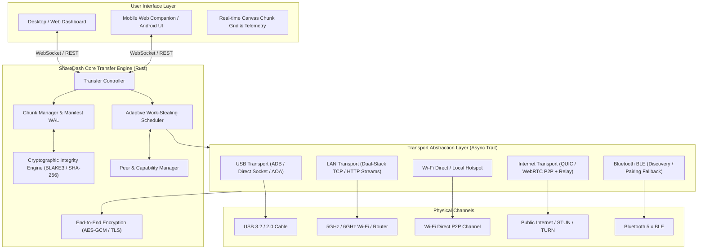
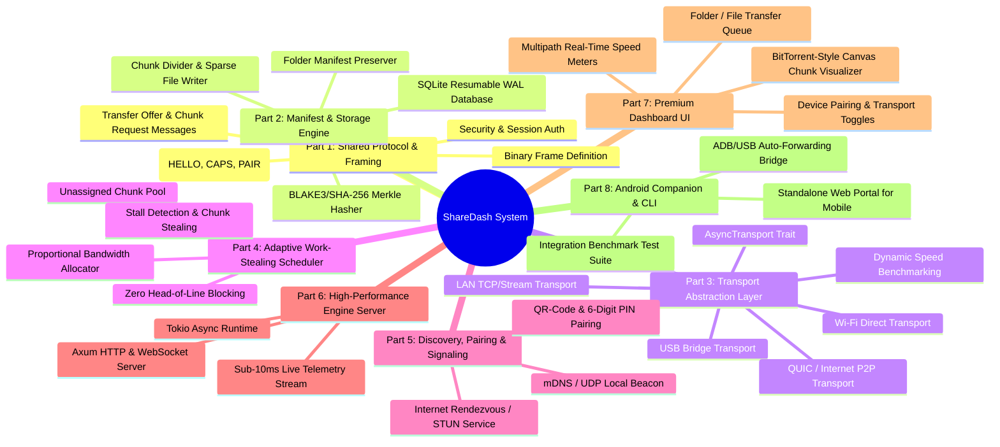

# ShareDash: Multipath Local + Internet File Transfer System

ShareDash is a high-performance, cross-platform, multipath file transfer engine designed to maximize real-world transfer speeds between devices (Android phone ↔ Windows/macOS/Linux laptop & desktop) by automatically discovering, benchmarking, selecting, and aggregating every available transport (USB 3.x/2.0, Wi-Fi Direct / Hotspot, Local Area Network, Ethernet, and Internet QUIC / P2P).

---

## User Review Required

> [!IMPORTANT]
> **Core Engine Technology Stack**:
> - **Backend / Core Engine**: Rust (`tokio`, `axum`, `quinn`/QUIC, `rusqlite`/manifest WAL, `ring`/`sha2` cryptographic primitives). Rust ensures bare-metal I/O performance, zero-copy socket transfers, memory safety, and cross-compilation for Windows, Linux, macOS, and Android (via JNI/NDK).
> - **Frontend / UI**: Modern, high-framerate Web + Desktop interface (HTML5, Vanilla CSS design system, High-Performance Canvas for the live BitTorrent-style chunk grid, WebSockets for sub-10ms telemetry streaming).
> - **Mobile Accessibility**: Dual-mode mobile support:
>   1. **Instant Web Companion**: Android / iOS can connect immediately via QR code in any browser on the local network or direct hotspot.
>   2. **Native Android Client / Companion Bridge**: Kotlin/Rust module utilizing Android USB Accessory/AOA, Wi-Fi P2P (`WifiP2pManager`), and background transfer service.

> [!NOTE]
> We will implement the system in clean, modular phases starting with the complete standalone Rust Core Multipath Engine, SQLite/WAL Manifest Resume Database, Work-Stealing Dynamic Scheduler, USB + LAN dual transports, Live WebSocket Telemetry, and the UI.

---

## System Architecture



---

## Component Breakdown & Division of Work



---

## Proposed Implementation Plan

### Part 1: Core Protocol & Binary Framing (`sharedash-core/src/protocol`)
- Standardized binary frame header:
  - Magic Byte (`0x53 0x44` = 'SD')
  - Protocol Version (u8)
  - Message Type Tag (u8: `HELLO`, `CAPABILITIES`, `PAIR_REQ`, `PAIR_RESP`, `OFFER`, `ACCEPT`, `MANIFEST`, `CHUNK_REQ`, `CHUNK_DATA`, `CHUNK_ACK`, `CHUNK_REJECT`, `BENCHMARK_PROBE`, `PING`, `PONG`, `PAUSE`, `RESUME`, `DONE`, `ERROR`)
  - Stream ID / Transfer ID (UUID / 16 bytes)
  - Chunk ID (u32)
  - Payload Length (u32)
  - Header CRC32 checksum
- Cryptographic session negotiation:
  - Ephemeral X25519 key exchange with ChaCha20-Poly1305 / AES-256-GCM AEAD encryption.
  - Zero-plaintext exposure for transfer metadata or payload.

### Part 2: Chunk Storage, Hasher & Manifest Engine (`sharedash-core/src/storage`)
- **Adaptive Chunking Engine**:
  - Automatically calculates optimal chunk size based on file size:
    - `< 50 MB`: 1 MB chunks
    - `50 MB - 500 MB`: 4 MB chunks
    - `500 MB - 10 GB`: 8 MB chunks
    - `> 10 GB`: 16 MB - 32 MB chunks
- **Sparse File & Direct Offset Writer**:
  - Pre-allocates target file space using OS-level sparse file allocation (`SetEndOfFile` / `fallocate`).
  - Writes received chunks directly at `offset = chunk_index * chunk_size` with zero memory copies of whole files.
- **SQLite / WAL Manifest Database**:
  - Persists transfer state table (`transfers`, `files`, `chunks`, `active_transports`).
  - Chunk status tracking: `PENDING`, `ASSIGNED`, `IN_FLIGHT`, `VERIFYING`, `COMPLETED`, `CORRUPTED`.
  - Immediate resume after crash, app restart, or sudden cable pull.
- **Folder Manifest Engine**:
  - Preserves hierarchical structure, relative paths, permissions, and file modification timestamps (`mtime`).

### Part 3: Transport Abstraction Layer (`sharedash-core/src/transport`)
- Unified `AsyncTransport` trait:
  ```rust
  #[async_trait]
  pub trait AsyncTransport: Send + Sync {
      fn id(&self) -> &str;
      fn transport_type(&self) -> TransportType; // USB, LAN, WifiDirect, Quic, Bluetooth
      async fn send_frame(&mut self, frame: Frame) -> Result<()>;
      async fn recv_frame(&mut self) -> Result<Frame>;
      async fn benchmark(&mut self, probe_bytes: usize) -> Result<TransportBenchmark>;
      fn current_metrics(&self) -> TransportMetrics; // throughput, rtt_ms, loss_rate, bytes_sent, bytes_recv
      async fn close(&mut self) -> Result<()>;
  }
  ```
- **LAN Transport**: Multi-stream TCP socket pool over local subnets.
- **USB Transport**: Direct ADB stream forwarder + raw socket connection. Automatically queries ADB daemon on Windows (`adb devices`, `adb forward tcp:X tcp:X`), falls back to direct USB network interface if present.
- **Direct Wi-Fi / Hotspot Transport**: Point-to-point Wi-Fi connection socket provider.
- **Internet QUIC / WebRTC Transport**: Encrypted UDP streams with STUN candidate exchange and relay fallback.

### Part 4: Adaptive Work-Stealing Chunk Scheduler (`sharedash-core/src/scheduler`)
- Shared thread-safe pool of uncompleted chunks.
- **Proportional Work Allocator**:
  - Each transport is allocated a dynamically sized "window" of in-flight chunk requests based on its moving average bandwidth:
    $$\text{Window}_i = \max\left(1, \left\lfloor \frac{\text{Throughput}_i \times \text{TargetBufferTime}}{\text{ChunkSize}} \right\rfloor\right)$$
  - Faster transports (e.g. USB @ 380 MB/s) keep 8-12 chunks in flight simultaneously.
  - Slower transports (e.g. Wi-Fi @ 40 MB/s) keep 1-2 chunks in flight.
- **Work-Stealing / Stall Eliminator**:
  - When a transport finishes its chunk requests and no unassigned chunks remain in the pool, it inspects in-flight chunks assigned to other transports.
  - If another transport's chunk has exceeded its predicted completion deadline ($t > 2.0 \times \text{ExpectedRTT}$), the idle fast transport duplicates/steals the chunk. The first completed and verified chunk wins; the duplicate is discarded cleanly.
  - Complete immunity to head-of-line blocking when a cable is pulled or Wi-Fi experiences interference.

### Part 5: Discovery, Pairing & Signaling (`sharedash-core/src/discovery`)
- **mDNS / UDP Broadcast Beacon**:
  - Broadcasts `_sharedash._tcp.local` beacons with device ID, friendly name, OS, and supported transport endpoints.
- **Security & Pairing**:
  - 6-digit PIN and visual QR Code generation for one-tap mobile pairing.
  - Mutual cryptographic confirmation before accepting any incoming transfer offer.

### Part 6: ShareDash Core Server & Live Telemetry Stream (`sharedash-core/src/server`)
- Embedded Axum server running on Tokio:
  - REST API for file selection, transfer control (`start`, `pause`, `resume`, `cancel`), transport toggles, settings.
  - Sub-10ms WebSocket feed streaming:
    - Real-time aggregate and per-transport throughput gauges (bytes/sec, MB/s).
    - Chunk-by-chunk live state (chunk ID, assigned transport, % downloaded, verification status) for the visualizer.
    - Peer discovery list and capability telemetry.

### Part 7: Modern Dashboard User Interface (`sharedash-ui`)
- Clean, aesthetic, responsive interface adhering strictly to design guidelines (no cliché dark/purple tropes, no textureless surfaces, no icon-stuffed bento boxes):
  - **Live Multipath Gauge Panel**: Dynamic speedometer dials / bar gauges showing USB, Wi-Fi LAN, Direct Wi-Fi, and Internet speeds in real time with aggregate totals.
  - **Interactive Canvas Chunk Grid**: Ultra-smooth BitTorrent-style piece visualizer rendering thousands of chunks with real-time color coding per transport (e.g., Teal for USB, Electric Blue for Wi-Fi LAN, Amber for Wi-Fi Direct, Purple for Internet).
  - **Transfer Offer & Pairing Modal**: QR Code & PIN prompt for incoming connections.
  - **File / Folder Queue Manager**: Drag & drop zone with tree view, size calculation, ETA countdown, and pause/resume buttons.
  - **Diagnostics & Benchmarking Panel**: Power-user modal displaying round-trip times, packet loss, socket buffer depths, and work-stealing event logs.
  - **Universal Mobile Web Companion**: Responsive mobile layout optimized for phone touchscreens when opening the transfer portal from Android / iOS.

### Part 8: Comprehensive Benchmark & Simulation Test Suite
- Automated end-to-end multi-transport test harness:
  - Simulates simultaneous USB (400 MB/s simulated bandwidth) + Wi-Fi (100 MB/s simulated bandwidth) transfers.
  - Verifies aggregate speed matches sum of paths ($\sim 500\text{ MB/s}$).
  - Injects mid-transfer transport disconnection and verifies zero-loss failover.
  - Injects corrupted chunks and verifies automatic SHA-256 detection and re-requesting.
  - Verifies multi-GB large files and nested directories bit-by-bit against source.

---

## Verification Plan

### Automated Tests
1. **Core Protocol & Framing Tests**:
   - `cargo test --package sharedash-core protocol`
   - Validates serialization, frame slicing, CRC32 checks, and cryptographic handshakes.
2. **Storage & Manifest Resume Tests**:
   - `cargo test --package sharedash-core storage`
   - Validates sparse file writing, chunk hashing, SQLite WAL recovery after interruption.
3. **Adaptive Scheduler & Work-Stealing Simulation Tests**:
   - `cargo test --package sharedash-core scheduler`
   - Runs multi-threaded virtual transport simulations with varying speeds, latency, and simulated cable disconnections.
4. **End-to-End File & Folder Transfer Integration Tests**:
   - `cargo test --package sharedash-core integration`
   - Transfers 100MB+ random payload and multi-file directory across dual virtual transports, asserting MD5/SHA256 identity.

### Manual Verification
1. Launch `sharedash` server on Windows host.
2. Open Dashboard UI in browser / Electron window (`http://localhost:54321`).
3. Connect mobile phone or secondary device via local Wi-Fi or USB.
4. Scan QR code or enter 6-digit PIN to pair.
5. Initiate file transfer and observe:
   - Live aggregate throughput combining both transports.
   - Real-time BitTorrent-style chunk grid animation.
   - Intentional cable unplug / Wi-Fi toggle to verify instantaneous dynamic work-stealing failover without transfer failure.
